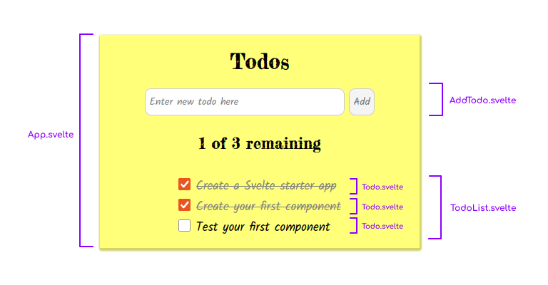

# Svelte Todo app with tests

This is a minimal Todo app to demonstrate how to test a Svelte app with [Jest](https://jestjs.io/) and [Svelte Testing Library](https://testing-library.com/docs/svelte-testing-library/intro).

You can run `npm run dev` to try the app out. The server will be listening at [http://localhost:3000/](http://localhost:3000/).

You can read the companion article - [Testing a Svelte app with Jest](https://www.roboleary.net/2021/11/18/svelte-app-testing-jest.html) to learn more about the project set-up.

## Features

The app should do the following:

1. List todos. When there are no items, the message "Congratulations, all done!" should be shown.
2. Allow a user to mark/unmark todos as done. When a todo is done, it is styled differently. The text color is gray and has a strike-through decoration.
3. Allow a user to add new todos, but prohibit the addition of an empty todo.

## Component overview

1. The `App` component contains the other components. It has a subheading that shows the status of the todos e.g "1 of 3 remaining ".
2. The `AddTodo` component contains the form with an text input and button to add new todos to our list.
3. A `TodoList` component, which will is an unordered list of the todos. Each list item contains a `Todo` component.
4. The `Todo` component shows the text of the todo and a checkbox for marking the item as done.

The child components dispatch events up to the `App` component to inform it when the data changes from user interaction. For example, `Todo` dispatches a `toggleTodo` event whenever its checkbox is clicked, this event is forwarded by `TodoList` to `App`.

## Tests

The tests are named as `<component_name>.spec.js` along side the component it is testing. You can run `npm run test` to run the test suites.

The tests operate on the actual DOM nodes, so that the tests are not tied to the implementation details of the framework. The goal is to resemble how the user interacts with the webpage.

The coverage is 98%.

## Linting

The project is set-up to lint CSS (with stylelint) and JavaScript (with ESLint). You can run `npm run lint` to lint both, and `npm run lint:fix` to fix any autofixable errors. This is done with the help of [`npm-run-all`](https://www.npmjs.com/package/npm-run-all).

## Helpful?

Star the repo to help others find it. 🌟

[Sponsor me/buy me a coffee](https://ko-fi.com/roboleary ) to enable me to create more open-source tutorials like this.
